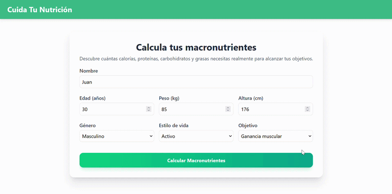
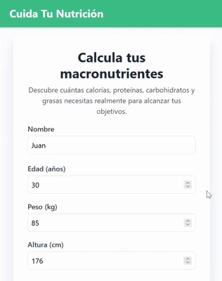

# WebMacros 


Aplicación web para estimar las calorías diarias y distribuir los macronutrientes en función de los datos personales, el estilo de vida y el objetivo del usuario.


## 💻 Vista previa

### Versión Escritorio


### Versión movil



## 💡 Motivación

La idea de WebMacros nace de una **experiencia personal**: la necesidad de poder revisar fácilmente si los objetivos nutricionales siguen estando coordinados con el estilo de vida actual.

Cuando una persona modifica sus objetivos, cambia su nivel de actividad física o simplemente quiere comprobar si su alimentación sigue estando alineada con sus necesidades, normalmente tiene que volver a buscar las fórmulas y **repetir todos los cálculos desde cero**.

WebMacros busca simplificar este proceso mediante una aplicación web **accesible, rápida y fácil de utilizar**. La persistencia local permite volver a consultar los resultados y actualizar los datos sin tener que comenzar de nuevo cada vez.

## 🚀 Sobre el proyecto

WebMacros nace como la evolución y migración a un entorno web de mi [proyecto de Trabajo de Fin de Grado](https://github.com/RonyArg/proyecto), desarrollado originalmente utilizando **Java, JavaFX, Hibernate y MySQL**.

La versión original permitía calcular las necesidades calóricas mediante una aplicación de escritorio. WebMacros traslada esta funcionalidad a una aplicación web **más accesible, sencilla y cómoda** de utilizar desde distintos dispositivos.

También se ha revisado la fórmula matemática utilizada y se han establecido **límites calóricos** para evitar resultados extremos.

## 🎯 ¿Qué problema resuelve?

WebMacros evita que el usuario tenga que repetir manualmente los cálculos cada vez que cambian sus circunstancias personales.

## ✨ Características principales

- **Formulario** con nombre, peso, altura, género, estilo de vida y objetivo.
- Estimación de las **calorías diarias** recomendadas.
- **Distribución orientativa** de proteínas, grasas y carbohidratos.
- **Límites calóricos integrados** en la fórmula para evitar valores extremos.
- **Persistencia de los datos** mediante `localStorage` para futuras visitas
- Posibilidad de **modificar los datos** personales.
- Interfaz **responsive** para dispositivos móviles y de escritorio.
- Diseño **sencillo e intuitivo**.

## ⚙️ Funcionamiento

El usuario completa un formulario con sus datos personales, su estilo de vida y el objetivo que desea alcanzar.

A partir de esta información, la aplicación genera una estimación de:

- **Calorías** diarias.
- **Proteínas** recomendadas.
- **Grasas** recomendadas.
- **Carbohidratos** recomendados.

Los resultados se presentan de forma clara y visual para facilitar su consulta.

## 🔒 Privacidad y almacenamiento de datos

Toda la información introducida se almacena **exclusivamente en el navegador** mediante la API de `localStorage`.

WebMacros **no utiliza una base de datos externa** ni envía los datos personales a ningún servidor o servicio de terceros.

> **Importante:** Los datos se almacenan únicamente en el navegador actual. Si se elimina el almacenamiento local del navegador, también se eliminará la información guardada por WebMacros.

## 🛠️ Tecnologías utilizadas

### Aplicación

- [React](https://react.dev/) `19.3.0`
- JavaScript
- HTML5
- CSS3
- [Tailwind CSS](https://tailwindcss.com/) `4.3.3`
- API `localStorage` del navegador

### Herramientas de desarrollo

- [Vite](https://vite.dev/) `8.3.0`
- Plugin React para Vite `6.1.1`
- Integración de Tailwind CSS para Vite `4.3.3`
- [ESLint](https://eslint.org/) `10.10.0`
- [pnpm](https://pnpm.io/) como gestor de paquetes

## 📈 Estado del proyecto

WebMacros se encuentra en **desarrollo activo**.

La funcionalidad principal ya está implementada y disponible para su uso, incluyendo:

- Formulario de introducción de datos.
- Selección del género, estilo de vida y objetivo.
- Estimación de las calorías diarias.
- Cálculo orientativo de los macronutrientes.
- Aplicación de límites calóricos.
- Persistencia de los datos mediante `localStorage`.
- Recuperación de los resultados en futuras visitas.
- Actualización de los datos y recálculo de los resultados.

## 🛤️ Próximos pasos

Las futuras mejoras previstas para el proyecto incluyen:

- Crear una **sección informativa o blog** con recomendaciones para llevar una vida saludable.
- Basar el contenido del blog en **estudios y fuentes fiables**.
- Añadir un **apartado explicativo** sobre la fórmula matemática utilizada.
- Mejorar la representación visual de los resultados.
- Continuar mejorando la experiencia de usuario.

## ⚕️ Consideraciones médicas importantes

Los resultados proporcionados por WebMacros son **estimaciones orientativas** basadas en los datos introducidos por el usuario.

La aplicación **no sustituye el asesoramiento de un médico, nutricionista u otro profesional sanitario**. Las necesidades nutricionales pueden variar dependiendo de factores individuales como:

- Estado de salud.
- Condiciones médicas existentes.
- Composición corporal.
- Edad.
- Medicación.
- Nivel real de actividad física.
- Objetivos personales.

> ⚠️ Si tienes dudas sobre tu alimentación, tus necesidades calóricas o la distribución de tus macronutrientes, consulta siempre con un profesional sanitario cualificado.

## 💻 Instalación y desarrollo local

Aunque WebMacros está pensado para utilizarse como una aplicación web, el proyecto puede ejecutarse localmente para desarrollo o revisión.

### Requisitos previos

- [Node.js](https://nodejs.org/) `20.19` o superior.
- [pnpm](https://pnpm.io/).

Puedes comprobar las versiones instaladas con:

```bash
node --version
pnpm --version
```

Si todavía no tienes pnpm instalado, puedes instalarlo mediante npm:

```bash
npm install --global pnpm
```

### Clonar el repositorio

```bash
git clone https://github.com/RonyArg/WebMacros.git
cd WebMacros
```

### Instalar las dependencias

```bash
pnpm install
```

### Iniciar el servidor de desarrollo

```bash
pnpm dev
```

La aplicación estará disponible normalmente en:

```text
http://localhost:5173
```

### Scripts disponibles

| Comando | Descripción |
| --- | --- |
| `pnpm dev` | Inicia el servidor de desarrollo con Vite. |
| `pnpm build` | Genera la versión optimizada para producción en `dist/`. |
| `pnpm preview` | Previsualiza localmente la versión de producción. |
| `pnpm lint` | Analiza el código en busca de errores y problemas de estilo. |

## 👤 Autor

Desarrollado por [RonyArg](https://github.com/RonyArg).

## 📄 Licencia

Este proyecto está bajo la Licencia MIT. Consulta el archivo [LICENSE](LICENSE) para más detalles.